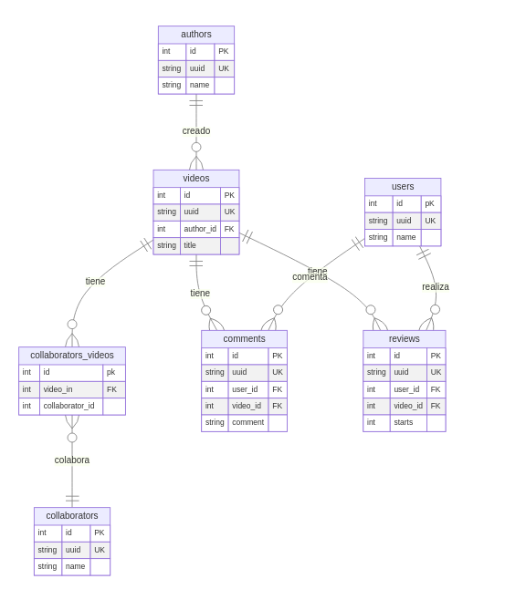

# Diagrama Entidad - Relación

## Ejercicio 4: Modelado de bases de datos

Para el modelado, se presenta el diagrama de Entidad-Relación creado con [Mermaid][mermaid], para poder visualizar este diagrama se requiere contar con el [Plugin para Visual Studio Code][plugin], para visualizar el código fuente del diagrama, consultar el [archivo](./diagram.md)



---

El script SQL que se muestra a continuación, está probado en PostgreSQL, con pocas modificaciones (para el soporte del UUID) se puede utilizar en otro RDBMS.

```sql
CREATE EXTENSION IF NOT EXISTS "uuid-ossp";


drop table if exists comments;
drop table if exists reviews;
drop table if exists collaborators_videos;
drop table if exists videos;
drop table if exists authors;
drop table if exists users;
drop table if exists collaborators;

create table authors (
    id      UUID DEFAULT uuid_generate_v4() primary key,
    name    varchar(50) not null check (name <> '')
);


create table videos (
    id          int             generated always as identity primary key,
    uuid        UUID            DEFAULT uuid_generate_v4(),
    author_id   UUID            not null,
    title       varchar(100)    not null check (title <> ''),

    unique (uuid),

    constraint videos_fk1
        foreign key (author_id)
        references authors(id)
);

create table users (
    id          int             generated always as identity primary key,
    uuid        UUID            DEFAULT uuid_generate_v4(),
    name        varchar(90)     not null check (name <> ''),

    unique (uuid)

);

create table collaborators (
    id      int         generated always as identity primary key,
    uuid    UUID        DEFAULT uuid_generate_v4(),
    name    varchar(50) not null check (name <> ''),

    unique(uuid)
);

create table collaborators_videos (
    id                  int     generated always as identity primary key,
    video_id            int     not null,
    collaborator_id     int      not null,

    constraint collaborators_videos_fk1
        foreign key (video_id)
        references videos(id),

    constraint collaborators_videos_fk2
        foreign key (collaborator_id)
        references collaborators(id)
);


create table comments (
    id          int     generated always as identity primary key,
    uuid        UUID    DEFAULT uuid_generate_v4(),
    video_id    int     not null,
    comment     text    not null,

    unique(uuid),

    constraint comments_fk1
        foreign key (video_id)
        references videos(id)

);

create table reviews (
    id          int     generated always as identity primary key,
    uuid        UUID    DEFAULT uuid_generate_v4(),
    video_id    int     not null,
    starts      int     not null check (starts > 0),

    constraint reviews_fk1
        foreign key (video_id)
        references videos(id)
);


```

[mermaid]: https://mermaid.js.org/syntax/entityRelationshipDiagram.html
[plugin]: https://marketplace.visualstudio.com/items?itemName=bierner.markdown-mermaid
