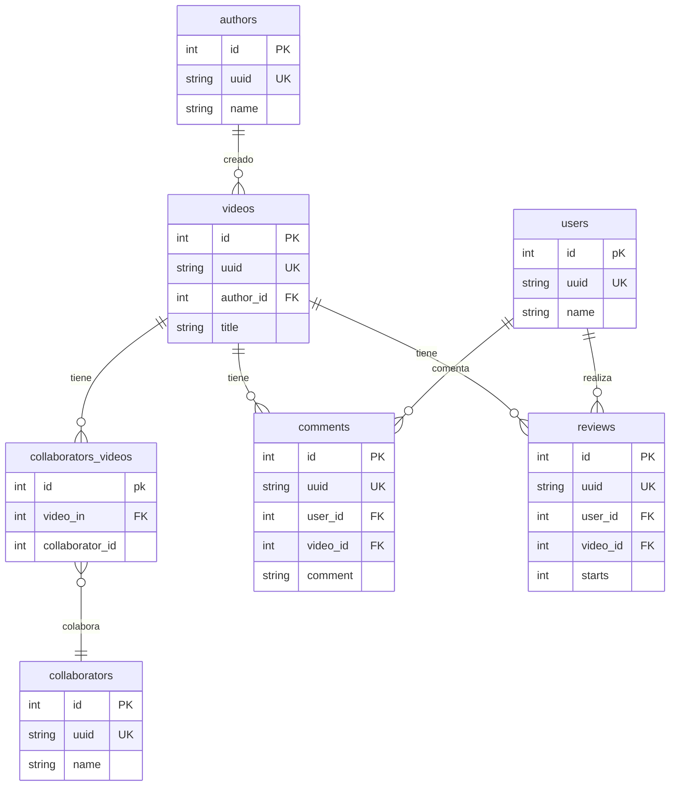

```mermaid

erDiagram
    authors ||--o{ videos : creado
    authors {
        int id PK
        string uuid UK
        string name
    }

    videos ||--o{ collaborators_videos : tiene
    videos ||--o{ comments : tiene
    videos ||--o{ reviews : tiene
    videos {
        int    id PK
        string uuid UK
        int    author_id FK
        string title
    }

    collaborators_videos }o--|| collaborators  : colabora
    collaborators_videos {
        int id pk
        int video_in FK
        int collaborator_id

    }

    collaborators {
        int id PK
        string uuid UK
        string name
    }


    users ||--o{ reviews : realiza
    users ||--o{ comments : comenta
    users {
        int     id pK
        string  uuid UK
        string  name
    }

    comments {
        int id PK
        string uuid UK
        int user_id FK
        int video_id FK
        string comment
    }

    reviews {
        int id PK
        string uuid UK
        int user_id FK
        int video_id FK
        int starts
    }

```
